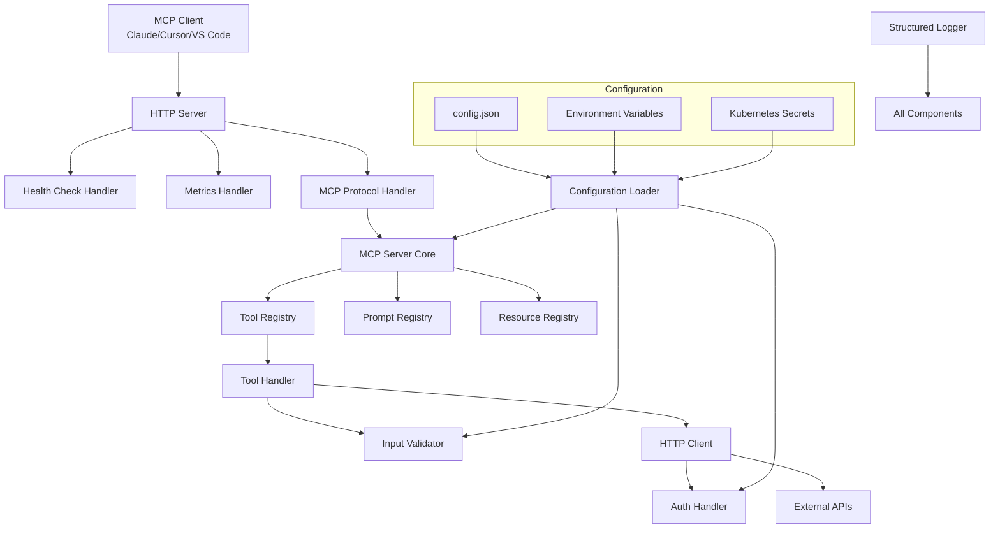
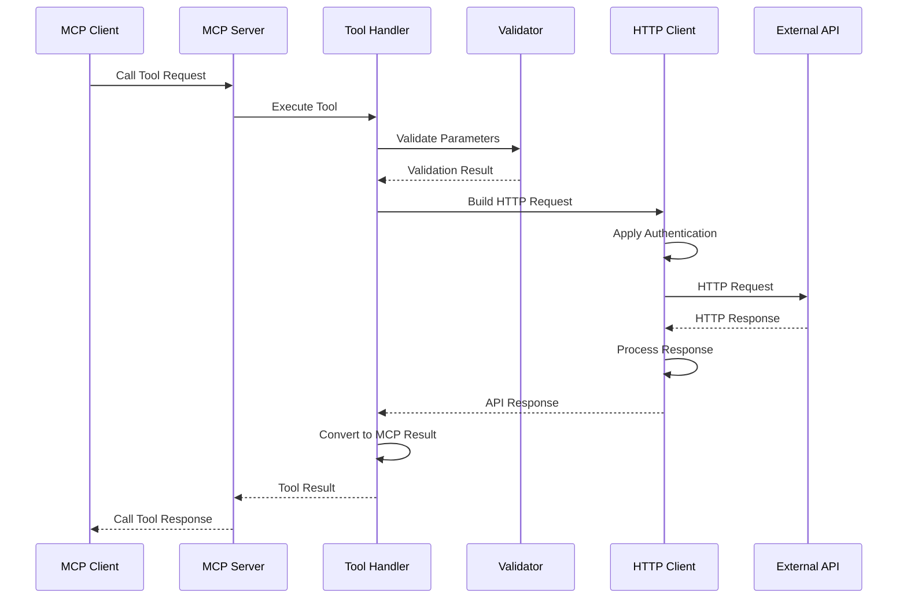
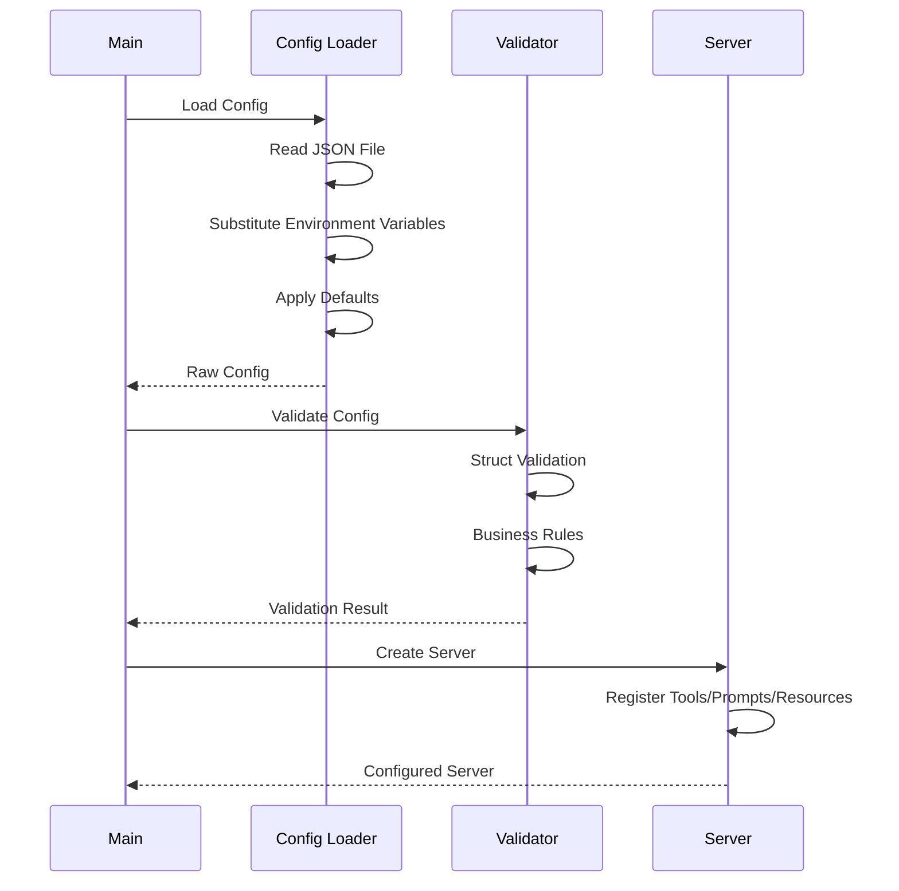

# MCP Server Template Architecture

This document provides a comprehensive overview of the MCP Server Template architecture, design decisions, and extensibility patterns.

## Table of Contents

- [Overview](#overview)
- [Core Principles](#core-principles)
- [Architecture Diagram](#architecture-diagram)
- [Component Details](#component-details)
- [Data Flow](#data-flow)
- [Configuration System](#configuration-system)
- [Extensibility Patterns](#extensibility-patterns)
- [Security Architecture](#security-architecture)
- [Performance Considerations](#performance-considerations)
- [Deployment Architecture](#deployment-architecture)

## Overview

The MCP Server Template is designed as a highly configurable, production-ready foundation for creating Model Context Protocol (MCP) servers. The architecture emphasizes:

- **Configuration-driven behavior**: All functionality is defined through JSON configuration
- **Dynamic tool registration**: Tools are registered and executed without code changes
- **Robust validation**: Comprehensive input/output validation and error handling
- **Cloud-native deployment**: Designed for containerized deployment in Kubernetes
- **Security by default**: Built-in security features and best practices
- **Extensibility**: Plugin architecture for custom functionality

## Core Principles

### 1. Separation of Concerns

The architecture is organized into distinct layers:

```
┌─────────────────────────────────────┐
│           Presentation Layer        │  ← HTTP API, Health Checks, Metrics
├─────────────────────────────────────┤
│           Business Logic Layer      │  ← Tool Execution, MCP Protocol
├─────────────────────────────────────┤
│           Configuration Layer       │  ← Config Loading, Validation
├─────────────────────────────────────┤
│           Infrastructure Layer      │  ← HTTP Client, Logging, Storage
└─────────────────────────────────────┘
```

### 2. Configuration as Code

All server behavior is driven by JSON configuration:

- **Tools**: API endpoints, authentication, parameters
- **Prompts**: Static prompts with argument substitution
- **Resources**: Static content served by the server
- **Security**: CORS, rate limiting, authentication settings
- **Runtime**: Concurrency, timeouts, logging configuration

### 3. Fail-Fast Validation

Validation occurs at multiple levels:

- **Configuration load time**: Structural and business rule validation
- **Runtime**: Input parameter validation before API calls
- **Response processing**: Output validation against expected schemas

### 4. Observability First

Built-in observability features:

- **Structured logging**: JSON-formatted logs with context
- **Health checks**: Comprehensive health status reporting
- **Metrics**: Prometheus-compatible metrics (optional)
- **Distributed tracing**: Correlation IDs for request tracking

## Architecture Diagram



## Component Details

### Configuration System (`internal/config/`)

**Purpose**: Load, validate, and manage server configuration

**Key Components**:
- `types.go`: Configuration structure definitions
- `loader.go`: Configuration loading and environment substitution
- `validator.go`: Validation rules and business logic

**Design Decisions**:
- **JSON-based**: Human-readable, widely supported format
- **Environment substitution**: Secure handling of secrets via `${VAR}` syntax
- **Comprehensive validation**: Both structural (tags) and business rule validation
- **Default values**: Sensible defaults for optional configuration

### Tool Handlers (`internal/handlers/`)

**Purpose**: Execute HTTP API calls based on tool configuration

**Key Components**:
- `tool_handler.go`: Tool registration and execution logic
- `http_client.go`: Configurable HTTP client with auth support

**Design Decisions**:
- **Dynamic registration**: Tools registered at runtime from configuration
- **Authentication abstraction**: Support for multiple auth types (Bearer, Basic, API Key, Custom)
- **Template support**: Go templates for dynamic header/body generation
- **Retry logic**: Configurable retry with exponential backoff
- **Response validation**: Validate API responses against expected criteria

### MCP Server Integration (`internal/server/`)

**Purpose**: Integrate with mark3labs/mcp-go SDK and manage server lifecycle

**Key Components**:
- `server.go`: Main server implementation and lifecycle management

**Design Decisions**:
- **SDK abstraction**: Wrap the MCP SDK to add configuration-driven behavior
- **Graceful shutdown**: Proper cleanup and connection draining
- **Health checks**: Multiple endpoints for different health aspects
- **Resource management**: File-based, URL-based, and inline content support

### Validation System (`internal/validation/`)

**Purpose**: Provide robust input/output validation and sanitization

**Key Components**:
- `validator.go`: Custom validation rules and error formatting

**Design Decisions**:
- **Multiple validation levels**: Struct tags, custom validators, business rules
- **Security-focused**: Input sanitization to prevent injection attacks
- **Extensible**: Easy to add new validation rules
- **Clear error messages**: Human-readable validation error reporting

## Data Flow

### Tool Execution Flow



### Configuration Loading Flow



## Configuration System

### Configuration Hierarchy

1. **Default values**: Applied automatically for optional fields
2. **JSON configuration**: Primary configuration source
3. **Environment variables**: Override JSON values using `${VAR}` syntax
4. **Runtime overrides**: Command-line flags for common settings

### Environment Variable Substitution

```json
{
  "tools": [{
    "headers": {
      "Authorization": "Bearer ${API_TOKEN}"
    }
  }]
}
```

The `${API_TOKEN}` placeholder is replaced with the value of the `API_TOKEN` environment variable at load time.

### Validation Layers

1. **Struct tags**: Basic validation (required, format, length)
2. **Custom validators**: Complex validation (semver, URLs, patterns)
3. **Business rules**: Cross-field validation (unique names, dependencies)

## Extensibility Patterns

### Plugin Architecture

The template is designed for extensibility through several patterns:

#### 1. Configuration Extensions

Add new tool types by extending the configuration schema:

```go
type ToolConfig struct {
    // Existing fields...
    DatabaseQuery *DatabaseQueryConfig `json:"database_query,omitempty"`
}

type DatabaseQueryConfig struct {
    ConnectionString string `json:"connection_string" validate:"required"`
    Query           string `json:"query" validate:"required"`
    Timeout         time.Duration `json:"timeout"`
}
```

#### 2. Handler Extensions

Implement custom tool handlers:

```go
type CustomToolHandler interface {
    ExecuteTool(ctx context.Context, config *ToolConfig, params map[string]interface{}) (*APIResponse, error)
    ValidateConfig(config *ToolConfig) error
}
```

#### 3. Middleware Support

HTTP client middleware for cross-cutting concerns:

```go
type Middleware func(http.RoundTripper) http.RoundTripper

func LoggingMiddleware() Middleware {
    return func(next http.RoundTripper) http.RoundTripper {
        return &loggingTransport{next: next}
    }
}
```

#### 4. Event Hooks

Lifecycle hooks for custom behavior:

```go
type ServerHooks struct {
    OnStartup    func(server *Server) error
    OnShutdown   func(server *Server) error
    OnToolCall   func(toolName string, params map[string]interface{})
    OnToolResult func(toolName string, result *CallToolResult)
}
```

## Security Architecture

### Input Validation

- **Parameter validation**: Type checking, range validation, pattern matching
- **Sanitization**: Remove dangerous characters and sequences
- **Schema validation**: Validate against JSON schemas

### Authentication

- **Multiple auth types**: Bearer tokens, Basic auth, API keys, custom headers
- **Environment-based secrets**: Secure handling of credentials
- **Token rotation**: Support for dynamic token refresh

### Network Security

- **TLS support**: HTTPS endpoints with configurable certificates
- **CORS configuration**: Fine-grained cross-origin access control
- **Rate limiting**: Configurable request rate limits

### Container Security

- **Non-root user**: Containers run as unprivileged user
- **Read-only filesystem**: Immutable container filesystem
- **Security contexts**: Kubernetes security contexts and policies

## Performance Considerations

### HTTP Client Optimization

- **Connection pooling**: Reuse HTTP connections for efficiency
- **Timeouts**: Configurable timeouts at multiple levels
- **Retry logic**: Exponential backoff with jitter
- **Context cancellation**: Proper request cancellation

### Concurrency

- **Configurable limits**: Maximum concurrent requests
- **Goroutine pools**: Bounded concurrency for API calls
- **Resource management**: Proper cleanup of resources

### Memory Management

- **Request streaming**: Handle large responses efficiently
- **Buffer pooling**: Reuse buffers for better memory usage
- **Garbage collection**: Minimize allocations in hot paths

### Caching

- **Response caching**: Cache API responses when appropriate
- **Configuration caching**: Cache parsed configuration
- **Connection caching**: HTTP connection pooling

## Deployment Architecture

### Container Architecture

```dockerfile
# Multi-stage build for minimal image
FROM golang:1.21-alpine AS builder
# ... build steps ...

FROM alpine:latest
RUN adduser -D -s /bin/sh appuser
USER appuser
# ... runtime setup ...
```

### Kubernetes Deployment

```yaml
apiVersion: apps/v1
kind: Deployment
metadata:
  name: mcp-server
spec:
  replicas: 3
  strategy:
    type: RollingUpdate
    rollingUpdate:
      maxSurge: 1
      maxUnavailable: 0
  template:
    spec:
      securityContext:
        runAsNonRoot: true
        runAsUser: 1001
      containers:
      - name: mcp-server
        securityContext:
          allowPrivilegeEscalation: false
          capabilities:
            drop: ["ALL"]
          readOnlyRootFilesystem: true
```

### Service Mesh Integration

The template is designed to work with service meshes like Istio:

- **Sidecar injection**: Compatible with automatic sidecar injection
- **Traffic policies**: Support for circuit breakers, retries, timeouts
- **Security policies**: mTLS, authorization policies
- **Observability**: Distributed tracing, metrics collection

### Monitoring and Observability

- **Health checks**: Liveness, readiness, and startup probes
- **Metrics**: Prometheus-compatible metrics endpoint
- **Logging**: Structured JSON logs for log aggregation
- **Tracing**: OpenTelemetry-compatible distributed tracing

## Future Considerations

### Planned Enhancements

1. **Plugin System**: Dynamic loading of custom tool handlers
2. **Configuration UI**: Web interface for configuration management
3. **Template Library**: Pre-built configurations for common APIs
4. **Schema Registry**: Centralized schema management
5. **Circuit Breakers**: Advanced failure handling
6. **GraphQL Support**: Native GraphQL API tool support

### Scalability Improvements

1. **Horizontal scaling**: Stateless design for easy scaling
2. **Load balancing**: Multiple server instances behind load balancers
3. **Cache layers**: Distributed caching for improved performance
4. **Database integration**: Persistent storage for dynamic configuration

This architecture provides a solid foundation for building production-ready MCP servers while maintaining flexibility for customization and extension. 